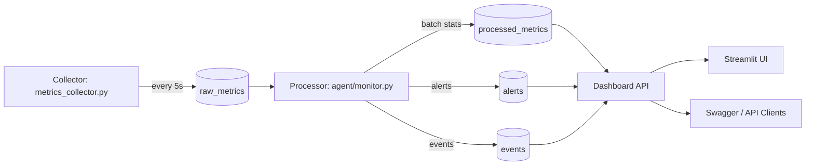

# Failure Detection and Monitoring System

Production-style monitoring backend built with FastAPI, SQLite, and a separate collector process.

## Overview

This project detects unhealthy behavior by collecting real host metrics, processing them in batches, and generating alerts when:
- values cross configured thresholds, or
- values show anomaly-like deviations from recent batch statistics.

It is designed as a learning-to-production bridge:
- simple enough to run locally,
- structured with clear separation of concerns (collector, processor, API, storage, alerting).

## Architecture



### Components

- `metrics_collector.py`
  - Separate process.
  - Collects real metrics (`cpu`, `memory`, `disk`) using `psutil` every 5 seconds.
  - Writes to `raw_metrics`.

- `agent/monitor.py`
  - Background processor running inside FastAPI app lifecycle.
  - Waits until enough raw rows exist (window size = 10).
  - Processes one batch: computes `mean/min/max/std_dev`, checks anomaly + thresholds.
  - Writes results to `processed_metrics`.
  - Creates alerts through `AlertManager`.

- `detector/engine.py`
  - Threshold map and threshold-check logic.
  - Anomaly utility logic.
  - Supports threshold updates.

- `alerting/alerts.py`
  - In-memory alert manager.
  - Tracks active/resolved alerts and aggregate stats.

- `storage/database.py`
  - SQLite schema management.
  - CRUD helpers for raw metrics, processed metrics, events.

- `dashboard/app.py`
  - Aggregates data for dashboard endpoints.

- `main.py`
  - FastAPI app + routes.
  - Starts/stops background processing agent.

## Data Flow (End-to-End)

1. Collector reads real host metrics every 5 seconds.
2. Collector inserts into `raw_metrics`.
3. Monitoring agent polls raw count every 5 seconds.
4. When `raw_count >= window_size (10)`, batch processing triggers.
5. Processor groups by metric type and computes statistics.
6. Processor checks:
   - threshold exceeded -> warning/critical alert
   - anomaly condition -> warning alert
7. Processor writes one record per metric to `processed_metrics`.
8. Processor logs event and clears raw buffer for next batch window.
9. Dashboard endpoints expose processed summaries, status, and alerts.

## Database Schema

### `raw_metrics`
- `id` (PK)
- `timestamp`
- `metric_type`
- `value`
- `server`
- `tags`

### `processed_metrics`
- `id` (PK)
- `batch_timestamp`
- `metric_type`
- `mean`
- `min_value`
- `max_value`
- `std_dev`
- `anomaly_detected`
- `threshold_exceeded`

### `alerts`
- `id` (PK)
- `timestamp`
- `level`
- `message`
- `source`
- `metric_type`
- `value`
- `threshold`
- `resolved`
- `resolved_at`

### `events`
- `id` (PK)
- `timestamp`
- `event_type`
- `data`

## API Reference

### Core
- `GET /` - service info + endpoint index
- `GET /health` - API health check
- `GET /health/detailed` - self-monitoring status of API, DB, agent, and collector lag

### Metrics
- `GET /metrics?limit=100`
  - Returns recent raw metric rows (compatibility shape).
- `POST /metrics`
  - Insert external/custom metric sample.

### Alerts
- `GET /alerts`
- `GET /alerts/active`
- `POST /alerts`
- `PUT /alerts/{alert_id}/resolve`
- `GET /alerts/stats`

### Dashboard
- `GET /dashboard`
  - Returns latest processed metrics, active alerts, stats, health status, events.
- `GET /dashboard/metrics-summary`
  - Batch-level summary by metric (`batches`, `anomalies`, `overall_mean/min/max`).
- `GET /dashboard/health`
  - Health derived from active alert severity.

### Agent
- `GET /agent/status`
  - `is_running`, `window_size`, `batches_processed`, `raw_metrics_count`, `active_alerts`.

### Thresholds
- `GET /thresholds`
- `PUT /thresholds/{metric}` with body:
  - `{ "value": 75.0 }`

## API Usage Examples

```bash
# Basic health
curl http://127.0.0.1:8000/health

# Detailed self-health (monitoring the monitor)
curl http://127.0.0.1:8000/health/detailed

# Agent status
curl http://127.0.0.1:8000/agent/status

# Update CPU threshold
curl -X PUT "http://127.0.0.1:8000/thresholds/cpu" \
  -H "Content-Type: application/json" \
  -d '{"value": 75.0}'

# Get summary
curl http://127.0.0.1:8000/dashboard/metrics-summary
```

## Cause-and-Effect Map (What Affects What)

- Collector stopped -> raw table stops growing -> no new batch processing.
- Raw rows below window size -> agent waits -> summary remains unchanged.
- High threshold values -> fewer alerts.
- Low threshold values -> more frequent alerts.
- Large sudden metric jump -> anomaly alert likely.
- Critical alerts increase -> `/dashboard/health` shifts to `critical`.
- Resolving alerts -> health can recover to `warning` or `healthy`.
- API restart -> persisted alerts are reloaded from DB.

## Implementation Approach

The solution uses a two-stage pipeline:

- **Stage 1: Ingestion**
  - fast and lightweight writes (`raw_metrics`) from collector.
- **Stage 2: Analysis**
  - periodic batch processing for stable statistical decisions.

This reduces noisy single-point decisions and mirrors real monitoring system behavior:
- decoupled producer (collector),
- processor with windowed analysis,
- summarized outputs for dashboard/operations.

## Run Instructions

### 1) Setup

```bash
cd /Users/nikhilcharantimath/Desktop/failure_detction/monitoring-system
python3 -m venv venv
./venv/bin/pip install -r requirements.txt
```

### 2) Start Collector (Terminal 1)

```bash
./run_collector.sh
```

### 3) Start Monitoring API (Terminal 2)

```bash
./run_monitoring.sh
```

### 4) Open Swagger

- [http://127.0.0.1:8000/docs](http://127.0.0.1:8000/docs)

### Optional UI (Streamlit)

Terminal 3:

```bash
./run_ui.sh
```

Then open:
- [http://localhost:8501](http://localhost:8501)

The Streamlit UI shows:
- system health and alert counts
- agent running state and batch progress
- processed metrics summary table + chart
- active alerts table

## Smoke Test Checklist

Expected `200`:
- `GET /`
- `GET /dashboard`
- `GET /dashboard/health`
- `GET /dashboard/metrics-summary`
- `GET /agent/status`

Also verify:
- `raw_metrics_count` increases while collector runs.
- `batches_processed` increments after enough samples are collected.

## Test Instructions

Run all tests:

```bash
./venv/bin/pytest -q
```

Current test coverage includes:
- unit tests for detector logic
- database and alert persistence tests
- API smoke tests
- integration pipeline test (raw -> batch process -> processed metrics + alerts)

## Unwanted File Cleanup Done

Removed generated artifacts from repository working tree:
- Python bytecode files under `__pycache__`
- local `monitoring.db`

Added `.gitignore` to prevent re-adding:
- `__pycache__/`
- `*.py[cod]`
- `*.db`
- local environment/cache artifacts

## Current Limitations

- Alert metadata is persisted in SQLite, but alert workflow is still basic (no ack/escalation policy).
- SQLite is local-node friendly, not distributed scale.
- No authentication/authorization yet.
- No CI pipeline yet (tests exist locally and pass via `pytest`).
- Collector currently covers host-level metrics only.

## Recommended Next Steps

- Add incident correlation table and analytics against alert history.
- Wire tests into CI (GitHub Actions).
- Add auth/rate limiting for APIs.
- Add retention and pruning policy.
- Add deployment profiles (`dev/staging/prod`) with per-environment thresholds.
- Rename repository for naming consistency (`failure-detection-and-monitoring-system`).

## Phase 1 Hardening Completed

- Added environment-based runtime config in `config.py`:
  - `APP_ENV` (`dev` or `prod`)
  - `DB_PATH`
  - `BATCH_WINDOW_SIZE`
  - optional per-metric overrides like `THRESHOLD_CPU`
- Added alert persistence fields and migration-safe schema updates in `storage/database.py`.
- Alert manager now persists new alerts to DB and reloads on startup.
- Added baseline pytest suite:
  - `tests/test_detection_engine.py`
  - `tests/test_database_and_alerts.py`
  - `tests/test_api_smoke.py`
